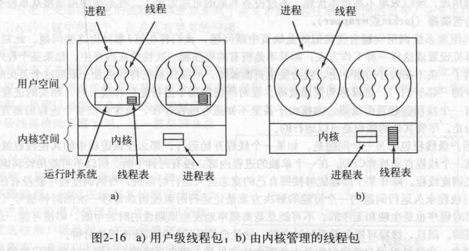
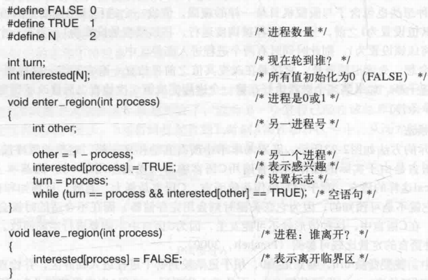
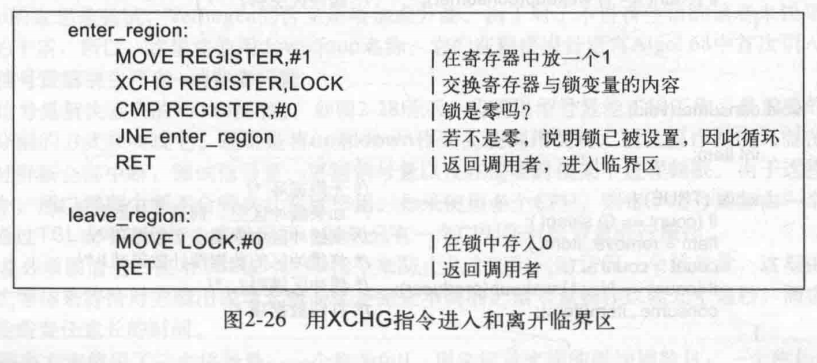
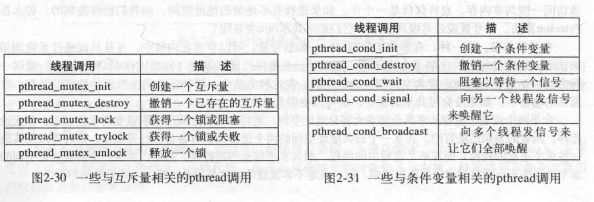

## 2.1 进程

### 2.1.1 进程模型

进程：在进程模型中，计算机上所有可运行的软件，通常也包括操作系统，被组织成若干顺序进程，简称进程。

### 2.1.2 进程的创建

四种主要事件会导致进程的创建：

+ 系统初始化
+ 正在运行的程序执行了创建进程的系统调用
+ 用户请求创建一个新进程
+ 一个批处理作业初始化

守护进程：停留在后台处理的特殊进程

unix 系统中，fork 可以创建新进程，父子进程拥有相同的内存映像、同样的环境字符串和同样的打开文件。

子进程执行 execve 或类似系统调用，可以修改内存映像并运行一个新程序。

之所以两步建立，是为了 fork 之后但 execve 之前允许子进程处理文件描述符，完成对标准输入文件、标准输出文件、标准错误文件的重定向。

execve 之后可写内存不可共享

### 2.1.3 进程的终止

进程终止通常属于以下情况

+ 正常退出
+ 出错退出
+ 严重退出
+ 被其他进程杀死

### 2.1.4 进程的层次结构

树形结构

进程及其衍生进程组成进程组。

如键盘发出一个信号，该信号被送给当前与键盘相关的进程组中所有成员

unix 系统中所有进程属于以 init 为根的一棵树

### 2.1.5 进程的状态

每个进程是一个独立的实体，有其自己的程序计数器和内部状态，但进程之间可能需要相互作用。

`cat chapter1 chapter2 chapter3 |grep tree`

第一个进程允许 cat，将三个文件连接输出。

第二个进程运行 grep，从输入中选择所有包含 『tree』的行

一个进程在逻辑上不能运行时，会被阻塞

在资源被占用情况，也会被迫停止运行

### 2.1.6 进程的实现

进程表：每个进程占用一个进程表项，表项记录程序状态的重要信息。使得进程再次启动时像未中断过一般

中断向量：中断服务程序的入口地址

### 2.1.7 多道程序设计模型

## 2.2线程

### 2.2.1 线程的使用

Q：需要多线程原因？

A：

可以使某些情况程序设计模型变得简单，线程共享同一地址空间和可用数据能力。

创建线程比创建进程快，更易撤销

更好的性能

### 2.2.2 经典的线程模型

进程把资源集中在一起，线程是在CPU上调度执行的实体

同一进程下线程共享，地址空间、打开文件集、子进程、定时器、相关信号等。

第一列给出在一个进程中所有线程共享内容

第二轮给出每个线程自己的内容

每个线程有自己的堆栈

库函数中有线程的一些操作，如创建线程、退出线程、等待某个线程退出、放弃cpu让其他线程运行

### 2.2.3 POSIX 线程

线程的标准，它定义的线程包叫作『pthread』

一些 `pthread` 的函数调用

+ `pthread_create` 创建一个新线程，新创建的线程标识符会作为函数返回值
+ `pthread_exit` 结束线程调用
+ `pthread_join` 等待一个特定的线程退出
+ `pthread_yield` 释放CPU来运行另一个线程

### 2.2.4 在用户空间中实现线程

在用户空间管理线程时，每个进程需要有专用的线程表。

线程表：跟踪该进程中的线程，记录线程属性如：程序计数器、堆栈、指针、寄存器等

进入阻塞：保存该线程寄存器，查看表中可运行的就绪线程，把新线程保存值重新装入寄存器。

这样的线程切换比陷入内核的方式快许多。

用户空间管理线程还有一个优势，允许每个进程有自己定制的调度算法

缺点：

不好实现阻塞系统调用

一个线程开始运行，其他线程不能运行，除非第一个线程自动放弃cpu

还有一点没看明白略过

### 2.2.5 在内核中实现线程

不需要运行时系统，每个进程中没有线程表，但内核中有记录所有线程的线程表。

内核的线程表维护 和 在用户空间中的线程表一样。

内核线程表维护信息是维护进程状态的子集。

阻塞时相较用户空间中实现，较慢。

问题：

多线程进程创建新进程，新进程拥有线程应该是一个还是同样多个

一个信号到达，应该由哪个线程处理它

### 2.2.6 混合实现

### 2.2.7 调度程序激活机制

目标：模拟内核线程功能，但为线程包提供通常在用户空间中才能实现的更好的性能和灵活性

避免用户空间和内核空间不必要转换，提高效率。例如，某个线程等待另个线程而阻塞，没必要请求内核。

使用调度程序激活机制时，内核给每个进程安排一定数量的虚拟处理器，让运行时系统将线程分配到处理器上。

上行调用：内核接收到一个线程阻塞，通知该进程运行时系统。

内核发现原线程又可运行时，再次上行调用运行时系统，通知这件事，再由运行时系统自行判断后续操作。

### 2.2.8 弹出式线程

弹出式线程：消息到达导致系统创建一个处理该消息的线程

创建线程快，消息到达与处理开始之间时间短

出错危害大，如某线程运行时间长，无法抢占，导致信息丢失

### 2.2.9 使用单线程代码多线程化

私有全局变量，每个线程拥有私有全局变量

一种访问方案，设计新的库，通过库来访问、创建、读取

还有一个问题许多库过程不可重入，如网络发送消息到缓冲区，发送过程中进行线程切换再次调用。

一种解决方案，重写库

另一种，使用包装器，包装器设置一个二进制位表示某个库处于使用中。会降低系统潜在并行性

信号问题，难处理

堆栈管理问题，处理麻烦

需要实质性重新设计系统

## 2.3 进程间通信

三个问题：

+ 如何传递信息
+ 如何确保信息不会交叉
+ 正确的顺序

### 2.3.1 竞争条件

多个进程竞争公共存储区，发生多次写在一个位置，造成信息丢失。

### 2.3.2 临界值

需要『互斥』解决竞争条件

临界区：对共享内存进行访问的程序片段

这样不能完美解决，需要满足以下四条件才完美

+ 任何两个进程不能同时处于临界区
+ 不应对 cpu 速度和数量做任何假设
+ 临界区外运行的进程不得阻塞其他进程
+ 不得使进程无限期等待进入临界区

### 2.3.3 忙等待的互斥

以下介绍几种互斥实现方案

**屏蔽中断**

简而言之就是屏蔽所有中断，使得程序一次跑完

基本不使用这方法

**锁变量**

用一个软件『锁』管理所有临界区。

不行，该软件本身可能产生竞争条件

**严格轮换法**

给每个进程一个锁代码，循环读取到符合条件（id=本身时）才进入，结束后修改 id。

不行，会被临界区外程序阻塞，如1程序要连续进入临界区两次，会等待下个临界区执行。

**Peterson 解法**

我在奇怪，这代码感觉只适用2个进程时

在进入临界区之前，各个进程用其进程号作为参数调用 `enter_region` ，会一直等待另个退出临界区。

**TSL 指令**

一种硬件支持的方案。多处理器计算机，都有一条指令 `TSL RX,LOCK` 称为测试并加锁。

将一个内存字 `lock` 读到寄存器 `RX`，然后在该内存地址上存一个非 0 值。读字和写字操作保证是不可分割的，即该指令结束前其他处理器不允许访问该内存字。执行 TSL 指令的CPU将锁住内存总线，禁止其他CPU在本指令结束前访问。

锁住内存总线不同于屏蔽中断，屏蔽中断不能阻止其他CPU访问。

TSL指令进入和离开临界区，需要进程合作才有效，不太行。

**XCHG 指令**

代替 TSL 的指令，所有 x86 CPU 在低层同步中使用 XCHG 指令

### 2.3.4 睡眠与唤醒

TSL 和 XCHG 都有忙等待的缺点。

sleep：挂起进程

wakeup：唤醒进程

#### 生产者消费者问题

也称有界缓存区问题

两个进程共享一个公共的固定大小的缓冲区，生产者将信息放入缓冲区，消费者从缓冲区取出消息。

生产者想放入消息，如果缓冲区已满，则睡眠，等待消费者取出在唤醒

消费者想要取出消息，如果缓冲区空，贼睡眠，等待生产者放入在唤醒

也存在竞争条件count记录缓冲区数据项数。可能会造成信号丢失

可以加入『唤醒等待位』存储信号，但原则上没有解决问题。

### 2.3.5 信号量

信号量：记录唤醒次数的整型，信号量操作不可分割。

down（P） 相当于 sleep，使信号量减一。

up （V）相当于 wakeup，使信号量加一。

#### 信号量解决生产者消费者问题

测试信号量、更新信号量、唤醒进程，操作不可分割。

多个 CPU 通过 TSL 或 XCHG 指令防止几个CPU访问一个信号量。

解决方案使用三个信号量：

+ full：记录充满的缓冲槽数目，初值 0
+ empty：记录空缓冲槽数目，初值缓冲区中槽数目
+ mutex：确保生产者消费者不会同时访问缓冲区。初值1

每个进程进入临界区前执行 down，刚刚退出执行up

### 2.3.6 互斥量

不需要信号量计数能力，可以使用信号量简化版本，即 **互斥量**

互斥量：只需要一个二进制，实现解锁和加锁，但通常是一个整型量，0表示解锁，其他为加锁

取锁失败可以调用 thread_yield 将 CPU 放弃给其他线程，不会忙等待

mutex_lock 加锁， mutex_unlock 两个操作都不需要内核调用，很快。

mutex_trylock 尝试获得锁或者返回返回码，但不阻碍线程。

之前一个问题未提出，现在提出：

Peterson算法、信号量、公共缓冲区中，如何共享 turn 变量（轮到谁）？

两种解决方案：

+ 有些共享数据结构放入内核中，通过系统调用访问
+ 多数现代操作系统提供，让进程和其他进程共享其部分地址空间。

**快速用户区互斥量 futex**

实现锁的基本功能，避免陷入内核，除非必须陷入内核

包含：一个内核服务、一个用户库

内核服务提供等待队列，进程在一个锁上等待。代价大，尽量避免这种情况。

没有竞争时，futex 完全在用户空间工作。进程共享锁变量，线程通过原子操作对锁操作。

**pthread中的互斥量**

为每个临界区设置相关互斥量

由程序员保证线程正确使用它们

pthread 还提供『条件变量』进行同步。

都是些原子性操作

### 2.3.7 管程

死锁，进程竞争资源相互阻塞无法执行

管程：一种高级同步语言，进程可以调用管程，但不能在外部访问管程内部数据。管程时语言概念

任意时刻管程中只能有一个活跃的进程。

进入管程互斥由编译器负责，因此出错可能性小。

将临界区资源转化为管程过程，实现互斥。

管程内部引入『条件变量』以及相关操作『wait』和『signal』

条件变量不是计数器，不能积累信号以后再用。

管程比信号量更容易保证编程正确性，但多数语言没有。指望编译器遵守互斥规则不合理。

分布式系统中不适用，信号量此时也显得低级

### 2.3.8 消息传递

这种进程间通信的方法用两条原语 `send` 和 `receive`，像信号量，是系统调用。

send：向给定目标发送一条消息

receive，从给定源（或任意源）接收一条消息。可能阻塞，可能带着错误码立即返回。

**设计要点**

+ 网络不可靠，可能重复接收到消息，计网知识
+ 进程命名问题
+ 身份认证问题
+ 性能问题，通常比信号量操作和进入管程慢

信箱：对一定数量的消息进行缓存的地方。

### 2.3.9 屏障

有些应用划分若干阶段，并且除非所有进程进入就绪着手下一阶段，否则任何进程都不能进入下一阶段。

可以通过在每个阶段结尾设置『屏障』解决。

屏障可以解决一组进程同步。

### 2.3.10 避免锁：读-复制-更新

最快的锁是没有锁（xswl）

某些情况运行别的进程使用它，即使自己还在写。窍门是让它读取旧版本的数据

实现略复杂，跳过

## 2.4 调度

### 2.4.1 调度简介

调度程序：选择下个运行的进程，使用的算法叫做『调度算法』

进程有『CPU密集型进程』『I/O密集型进程』，随着 CPU 越来越快，更多进程倾向『I/O密集型进程』

何时调度

+ 创建新进程
+ 一个进程退出
+ 进程阻塞
+ I/O 中断

调度算法分为

+ 非抢占式调度算法：让进程运行直到结束或阻塞的调度方式
+ 抢占式调度算法：允许将可继续运行的进程在运行过程暂停的调度方式 

不同环境需要不同的调度算法

+ 批处理
+ 交互式：抢占式调度算法
+ 实时

不同环境调度算法有不同的目标

所有系统：公平、策略强制执行、平衡

交互式：响应时间、均衡性

### 2.4.2 批处理系统中的调度

#### 先来先服务

最简单的非抢占式算法

不适合 I/O 密集型

#### 最短作业优先

适用运行时间可以预知的，非抢占式批处理调度算法

#### 最短剩余时间优先

最短作业优先的抢占式版本。

每次来新的进程，同当前进程剩余时间比较，短的先运行。

### 2.4.3 交互式系统中的调度

#### 轮转调度

设置时间片，每个进程执行一段时间片，如果进程提前结束或阻塞，CPU立即切换。

进程切换，有时称为上下文切换。

时间片设置太短，CPU 利用率不高，太长则短的交互请求时间响应可能过长

#### 优先级调度

一种实现

对每个进程设置优先级，I/O 密集型、指令短能快速解决的优先级高。

将优先级分成若干类，同类之间使用轮转调度算法。

#### 多级队列

不难描述复杂，略过

#### 短进程优先

根据过去行为推测，执行估计运行时间最短的那一个

比如 $T_{预测}=aT_{预测}+(1-a)T_{本次}$

#### 保证调度

#### 彩票调度

通过随机算法，给进程分配 CPU，重要进程抽中比值高。

#### 公平分享调度

根据用户分配 CPU 占用时间，而不是根据进程，避免一个用户开太多进程导致不公平。

### 2.4.4 实时系统中的调度

硬实时：绝对的截止时间

软实时：可以容忍错过截止时间

可调度：知道周期事件，周期时间和 CPU 处理时间，能负载即可调用。

### 2.4.5 策略和机制

主进程掌握每个子进程的决策信息，之前算法没有一个接收，导致没有做出最优选择。

解决方法：将『调度机制』和『调度策略』分离，将调度算法以某种形式参数化，供用户进程填写。

### 2.4.6 线程调度

用户级线程，线程对内核隐藏所以线程操作由进程决定。

内核级线程，内核对线程直接操作，可以不考虑线程属于哪个进程。

内核级

线程切换慢。

进程A的线程切换到进程B的线程，代价大于进程A的线程切换到进程A的另个线程。

用户级：

线程阻塞会挂起整个进程，而内核级不会。

能够定制线程调度程序

## 2.5 经典的 IPC 问题

### 2.5.1 哲学家就餐问题

互斥访问有限资源的竞争问题

### 2.5.2 读者-写者问题

## 2.6 有关进程与线程的研究

## 2.7 小结

