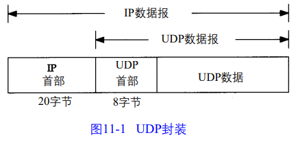
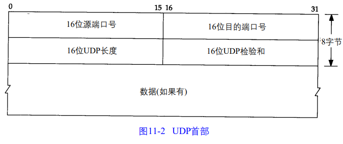
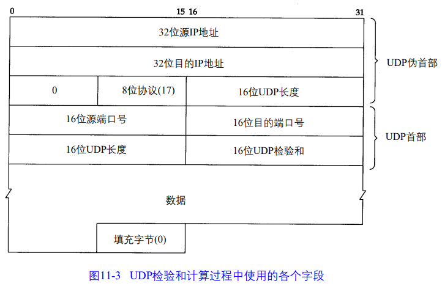

# 第 11 章 UPD：用户数据报协议

## 11.1 引言

UDP：面向数据报的传输层协议，每次操作正好产生一个 UDP 数据报

TCP 面向流字符。

UDP 封装成IP 数据报

RCF 768 是 UDP 的正式规范，UDP不可靠。

IP 数据报超过 MTU（最大传输单元）需要进行分片，11.5节介绍。

## 11.2 UDP 首部

UDP 首部如下：

端口号：发送进程、接收进程。

UDP 长度：UDP 首部和UDP 数据的字节长度。最小值是 8 字节（发送0字节数据的UDP数据报）

## 11.3 UDP 检验和

UDP 检验和覆盖，UDP 首部和 UDP 数据。UDP 检验和是可选的。

UDP检验和的基本计算方法与 IP首部检验和计算方法相类似（16 bit字的二进制反码和）但是它们之间存在不同的地方。

UDP 数据报的长度可以为奇数字节，但是检验和算法是把若干个 16 bit 字相加。

解决方法是必要时在最后填充字节 0，这只是为了检验和的计算（也就是说，可能增加的填充字节不被传送）

UDP 数据报和 TCP 段都包含一个 12 字节长的伪首部，它是为了计算检验和而设置的。

检验和目的：

+ 发现 UDP 首部和数据在发送端到接收端之间发生的任何改动。 
  + 伪首部包含 IP 首部一些字段。其目的是让 UDP  检查数据是否已经正确到达目的地（正确的主机，正确的协议）。

疑问：伪首部哪来的

网上别人理解，伪首部并非TCP&UDP数据报中实际的有效成分。伪首部是一个虚拟的数据结构，其中的信息是从数据报所在IP分组头的分组头中提取的，既不向下传送也不向上递交，而仅仅是为计算校验和。

传输的检验和为 0，说明发送端没发送检验和。

如果发送端没有计算检验和而接收端检测到检验和有差错，那么 UDP 数据报就要被悄悄地丢弃。不产生任何差错报文 。 ？？？没计算检验和怎么检测检验和有差错

RFC 规定	UDP检验和选项默认打开。但许多系统没有打开

不要完全相信 UDP&TCP 检验和，因为都可能出错。（以前就好奇不会出错吗

## 11.5 IP 分片

选路：ip 层收到数据报，判断本地哪个接口发送数据。

分片：把 MTU（最大传输单元）与数据报长度比较，如果需要则进行分片。

分片可以发生在发送端主机，也可以发生在中间路由器上

把 ip 数据报分片后，到达目的地进行重新组装，要求是在下一站组装而不是最终目的地。

组装由目的端 ip 层完成。

ip 首部中包含的数据为分片和重新组装提供了足够的信息。

分片过程看起来透明，但是有个缺点即使丢失一片数据也要重传整个数据报。

UDP容易导致分片

ip层分片后，运输层首部消息只在第一片出现，如UDP的源端口号、目的端口号

## 11.6 ICMP 不可达错误（需要分片）

ICMP 经常被认为是 IP 层的一个组成部分。它传递差错报文以及其他需要注意的信息。ICMP 报文通常被 IP 层或更高层协议（TCP&UDP）使用。一些 ICMP 报文把差错报文返回给用户进程。

发现好多前置知识没学 略过。。

## 11.10 最大 UDP 数据报长度

理论上 IP 数据报最大长度 65535 字节，由 ip 首部 16 bit 限制

除去 20字节 IP 首部，8字节 UDP 首部，UDP 中用户数据的最长长度65507字节，但大多数实现提供比这个小。

两个限制

+ 应用程序可能收到程序接口限制，比如 UDP socket，这个长度与应用程序可读写最大长度有关。
+ 限制来自 TCP/IP 的内核实现，可能存在一些实现特性（或差错），使 IP 数据报小于 65535 字节

许多应用程序设计，程序数据限制成 512 字节或更小，因为主机最短必须接收 576 字节 IP 数据报

**数据报截断**

如果接收到的数据报长度大于应用程序能处理的长度，会发生什么，取决编程接口和实现

## 11.12 UDP 服务器设计

**客户 IP 地址及端口号**

IP 首部包含源端和目的端 IP 地址， UDP 首部包含了源端和目的端的 UDP 端口号。当一个应用程序收到 UDP 数据报，操作系统必须告诉他源 IP 地址和端口号

**目的 IP 地址**

一些应用程序需要知道数据报发给谁的，即目的 IP 地址

不是所有实现都有这功能，socket API 以 IP_RECVDSTADDR socket选项提供了这个功能

**UDP 输入队列**

每个 UDP 端口都与一个有限大小的输入队列相联系，差不多同时到达的请求将派队。

排队可能造成内核中的 UDP 模块丢弃数据报

**限制本地 IP 地址**

**限制远端 IP 地址**

**每个端口有多个接收者**

