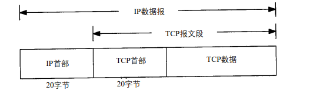
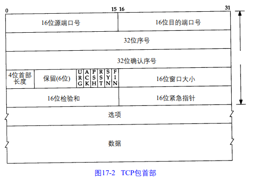

# 第 17 章 TCP 传输控制协议

## 17.1 引言

本章介绍 TCP 为应用层提供的服务，以及 TCP 首部各个字段。

18 章描述如何建立和终止一个 TCP 连接

19 和 20 章将了解正常的数据传输过程，包括交互使用（远程登录）和批量数据传输（文件传输）

21 章提供 TCP 超时及重传的技术细节

22 和 23 章将介绍两种其他的定时器

24 章概述 TCP 新特性 以及 TCP 的性能

## 17.2 TCP 的服务

TCP 提供一种面向连接、可靠的字节流服务。

面向连接：两个使用 TCP 的应用在彼此交换数据之前需要建立一个 TCP 连接。

TCP 通过下列方式提供可靠性：

+ 应用数据被分割成 TCP  认为的最适合发送的数据块，由 TCP 传递给 IP 的信息单位称为『报文段』或『段』
+ 当 TCP 发出一个段之后，它启动一个定时器，等待目的端确认收到这个报文段。如果不能及时收到一个确认，将重发这个报文段
+ 当 TCP 收到发自 TCP 连接另一端的数据，它将发送一个确认，确认不是立即发送，通常推迟几分之一秒
+ TCP 将保持它首部和数据的检验和。这是一个端到端的检验和，检测数据是否在传输过程中发生变化，如果有差错将丢弃这个报文段
+ TCP 接收端必须丢弃重复的数据
+ TCP 还能提供流量控制，TCP 连接的每一方都有固定大小的缓冲空间。TCP 接收端只允许另一端发送接收端缓冲区所能接纳的数据。避免缓冲区溢出

TCP 对字节流内容不作任何解释，解释由应用层完成。

## 17.3 TCP的首部

下面是首部数据格式，如果不计任选字段，它通常是 20 个字节

源端口号、目的端口号：每个 TCP 段都包含源端口号和目的端口号，用于寻找发端和收端应用程序。这两个值加上 IP 首部中的源端 IP 地址和目的端 IP 地址唯一确定一个 TCP 连接。

插口（socket）：一个 IP 地址和一个端口号

插口对（socket pair）：可唯一确定互联网中每个 TCP 连接的双方

序号：标识 TCP 发端向 TCP 收端发送的数据字节流，表示这个报文段中的第一个数据字节。序号是 32 bit 无符号整数，序号达到 $2^{32}-1$ 后从 0 开始。

下面应该是将建立 TCP 连接过程

建立一个新的连接时，SYN 标志变为 1。序号字段包含这个主机选择的该连接的初始序号『ISN』。该主机要发送数据的第一个字节序号为这个 ISN 加 1，因为 SYN 标志消耗了一个序号（下章详细介绍）。

确认序号：包含发送确认的一端，所期望收到的下一个序号。所以确认序号是上次已成功收到数据字节序号加 1。只有 ACK 标志 为 1 时确认序号字段才有效。

发送 ACK 无需任何代价，因为本身是首部一部分（这也算没有代价吗。。），因此一旦连接建立，这个字段总是被设置，ACK 标志也总被设置为 1

TCP 是全双工服务，说明能够两个方向上独立地进行传输。因此，连接的每一端必须保持每个方向上的传输数据序号。

TCP 是一个没有确认或否认的滑动窗口协议。

4 位首部长度：最多表示15，单位是 32 bit，所以 4 位首部长度最多有 60 字节的首部，没有仍和任选字段，正常长度为 20 字节。（为什么最少都20字节，不能含义改成选项长度，这样还能让选项多点）

TCP 首部有 6 个标志比特，后面详细介绍。

+ URG 紧急指针有效（20.8 节）
+ ACK 确认序号有效
+ PSH 接收方应该尽快将这个报文交给应用层
+ RST 重建连接
+ SYN 同步序号用来发起一个连接。（18 章介绍）
+ FIN 发端完成发送任务

16 位窗口大小：单位是字节数，所以窗口最大 65535 字节。24.4 节将介绍更大窗口的方法。

检验和：覆盖整个 TCP 报文端：TCP 首部和 TCP 数据。一个强制性字段，发端计算存储，收端验证。和 UDP 一样需要一个伪首部。

紧急指针：URG 标志为 1 时有效。一个正的偏移量，和序号字段的值相加表示紧急数据最后一个字节的序号。20.8 节介绍

可选字段：最常见是最长报文大小（MSS）。每个连接方通常第一个报文段中指明这个选项，表示本端所能接收最大长度的报文段。18.4 节介绍，其他选项一些在第 24 章介绍。

数据：也是可选的，存在不发消息的情况，后面介绍。

## 17.4 小结

TCP：可靠的面向连接的字节流运输层服务。

17.3 简单介绍首部各个字段

端到端验证计算和是强制性的。UDP 我记得是可选的。