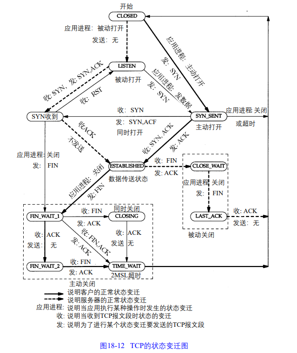

# 第 18 章 TCP 连接的建立与终止

## 18.1 引言

TCP 面向连接。发送数据前，双方之间需要建立一条连接。

## 18.2 连接的建立与终止

### 18.2.1 tcpdump 输出

一个抓包工具，这里介绍，这里介绍了 tcpdump 输出显示的各个字段代表什么。

先跳过，不好做笔记，忘了回来再看看。

### 18.2 时间系列

### 18.2.3 建立连接协议

三次握手

+ 客户端发送一个 SYN 段指明客户打算连接的服务器端口，以及初始序号（ISN）
+ 服务器发回包含服务器的初始序号的 SYN 段，作为回答。同时将确认序号设置为客户的 ISN 加 1 以对客户的SYN报文段进行确认。（后面一句话一个 SYN 占用一个序号。SYN 不是在首部内吗，发送的难道不是没有数据的报文吗，所以笔记上不记这句话，影响应该不大。目前我将确认序号理解为想要收到的下个序号开头）
+ 客户端将确认序号设置为服务器的 ISN+1 以对服务器 SYN 报文段进行确认。

主动打开：发送第一个 SYN 的一端

被动打开：接收主动打开并发回下一个 SYN 的一端

初始序号（ISN）随时间变化而变化，`RFC 793` 指出 ISN 可以看作 32 bit 的计数器，每 4 ms 加 1。避免在网络中被延迟的分组以后又被传送导致错误解释。除了规定的 ISN 变化方法，还有许多实现是初始为 1 每 0.5 秒增加 64000。

### 18.2.4 连接终止协议

TCP 半关闭，关闭一个方向的连接。

4次挥手，假设客户端是第一个关闭的一方

+ 应用程序关闭，客户端发送第一个 FIN 执行主动关闭
+ 当服务器收到这个 FIN，发回一个  ACK（确认序号为收到序号加 1），并且服务器向应用程序传送一个文件结束符
+ 应用程序关闭它的连接，并且服务端向客户端发送一个 FIN
+ 客户端发回一个确认（FIN 的 ACK，ACK 是由 TCP 软件自动产生的）

### 18.2.5 正常的 tcpdump 输出

-S选项得到序号与初始序号的偏移量

## 18.3 连接建立的超时

典序的伯克利实现版，系统初始序列号为 1，每隔 0.5 秒增加 64000。最长建立新连接的时间限制 75 秒（不一定）。

### 18.3.1 第一次超时时间

BSD 版的 TCP 软件采用 500 ms 定时器。这种定时器用于确定本章中所有的 TCP 超时。如一个 6 秒定时器，可能在之后 5.5-6 秒内的任意时刻超时。第一个 0-500 ms 内是可变的，定时器大约每 500 ms 减 1。

### 18.3.2 服务类型字段

[tos 0x10]，IP 数据报内的数据类型（TOS）字段。设置为最小时延。

这里先不管了

### 18.4 最大报文段长度

最大报文长度（MSS）：TCP 传往另一端的最大块数据的长度（不包括 TCP 与 IP 协议头长度）

连接建立时，双方需要通告各自的 MSS。

建立一个连接时，双方都有用于通过它期望接收的 MSS 选项（MSS 选项只能出现在 SYN 报文段中）。如果一方不接收另一方的 MSS 值，MSS 定为默认值 536 字节。

一般来说，没有分段发生，MSS 越大越好。这样网络利用率高。主机建立连接发起 SYN 时，它能将 MSS 值设置为外出接口上 MTU（ip 层最大传输单元）长度减去 IP 首部和 TCP 首部

这里默认大小，不同情况不同系统还有不同的值，没必要写笔记感觉，了解 MSS 干什么就好，然后知道只知道字节 MTU 还是会分段，需要整个连接路径上的 MTU（24.2 节）。

### 18.5 TCP 的半关闭

半关闭：TCP 提供连接的一端结束它的发送后还能接收来自另一端数据的能力。

网络编程接口，提供 shutdown 支持半关闭。

为什么要有半关闭？

AB 两个主机，A 可以提醒 B，A 输入已经结束，但 A 仍然需要接收 B 的输出。不用半关闭可能效果比较差。

### 18.6 TCP 的状态变迁图

这图乍一看吓到我了，然后仔细看会发现还是挺好懂的，就几种不同情况的分支，顺便看到了前面提及还没细讲的同时关闭，同时发起。

#### 18.6.1 2MSL 等待

TIME_WAIT 状态也称为『2MSL』等待状态

MSL：报文段最大生存时间，RFC 793 指出 MSL 为 2分钟，现实常用，30 秒、1 分钟、2 分钟

作用：

当一个 TCP 执行一个主动关闭，并发回最后一个 ACK（即第四次挥手），该连接必须在 TIME_WAIT 状态停留的时间为 2 倍 MSL。这样可以让 TCP 再次发送最后的 ACK 以防止这个 ACK 丢失。

注意：

在 2MSL 期间定义这个连接的插口不能被使用，并且任何迟到的报文段都将丢弃。

客户执行主动关闭并进入 TIME_WAIT 是正常的，服务器通常执行被动关闭，因为服务器使用熟知端口，如果主动关闭将进入 2MSL。

替身（incarnation）：一个连接由一个插口对来定义。一个连接的新的实例称为该连接的替身

一个贼麻烦的例子看了半天，大概是 TIME_WAIT 期间重用端口对创造新连接的方法。（违反 TCP 规范）

#### 18.6.2 平静时间的概念

上面看了半天，这里讲解决上面问题的方法。应该是

2MSL 等待期间，主机出现故障快速重启可能会立即使用故障前处于 2MSL 的插口建立新的连接。这样会产生之前连接迟到报文当作新连接的报文。无论重启后新连接的初始序号都会发生这情况（不是可以不接收吗。。）

如何避免，RFC 793 指出 TCP 重启后的 MSL 内不能建立任何连接。这称为『平静时间』

只有极少的实现版遵守这一原则，因为大多数主机重启的时间比 MSL 秒长。

#### 18.6.3 FIN_WAIT_2 状态

FIN_WAIT_2 应该是在第二次挥手结束等待另一端第三次挥手的时间。

如果这时另一端不挥手，我们这端将永远保持这个状态。

如何避免 FIN_WAIT_2 状态无限等待。伯克利实现采用计时器，计时器到时进入关闭状态。

### 18.7 复位报文段

TCP 首部中的 RST bit 是用于『复位』的。一个报文段发往连接出现错误，TCP 都会发出一个复位报文段。

#### 18.7.1 到不存在的端口的连接请求

产生复位的一种常见情况，当连接请求到达，目的端口没有进程在监听。UDP 看到这种情况会产生 ICMP 端口不可达信息。TCP 使用复位。

我是傻逼看不懂他后半段在讲个啥。

看了下别人的博客，大概就是请求连接错误服务器返回 RST 复位信号（用来关闭异常连接）。顺便了解了下 RST 攻击和防御（虽然和我没关系）。

#### 18.7.2 异常终止一个连接

有序释放：终止一个连接的正常方式是一方发送 FIN

异常释放：发送一个复位报文段而不是 FIN 来中途释放一个连接

异常终止优点：

+ 丢弃任何待发数据并立即发送复位报文段
+ RST 的接收方会区分另一端执行的是异常关闭还是正常关闭

RST 接收端不会做任何响应。

#### 18.7.3 检测半打开连接

半打开（Half-Open）连接：一方已经关闭或异常终止连接而另一方却还不知道

这个例子只讲了服务器重启后连接异常终止，这时客户端发送消息，服务器返回 RST。比较好奇服务器关机了会发生什么（我也没做实验）。

查了下别人博客，分了许多种连接异常处理情况，这里提一下。

服务器主机崩溃，多次超时重传失败会关闭客户端 TCP 连接。

服务器崩溃后重启，服务器收到消息会返回 RST。

服务器端口被关闭，服务器收到消息返回 RST。

### 18.8 同时打开

同时打开：两个应用程序同时彼此主动打开连接。可能性小，每一方必须发送一个 SYN 且传递给对方，这需要每一方使用一个对方熟知的端口作为本地端口。

一个同时打开的连接需要交换 4 个报文段，比正常三次握手多一个。（应该是三次握手将其中两个报文段合在一起了）

### 18.9 同时关闭

感觉与四次挥手差别不大，两边同时发送 FIN，而不是一边先发送。

### 18.10 TCP 选项

RFC 1323 定义了新的 TCP 选项。

1 字节选项种类，后面跟着相应选项需要的信息。

选型表结束：kind = 0，占 1 字节。

无操作：kind = 1，占 1 字节。用处：填充选型字段到 4 字节倍数，因为首部长度最小单位 4 字节。

最大报文段长度：kind = 2，占一字节；len = 4，占一字节；最大报文段长度，占二字节。

### 18.11 TCP 服务器的设计

服务器进程接收客户端进程的服务请求时如何处理端口？

如果多个连接请求几乎同时到达发生什么情况？

#### 18.11.1 TCP 服务器端口号

TCP 使用由本地地址和远端地址组成的 4 元组：目的 IP 地址、目的端口号、源 IP 地址、源端口号来处理传入的多个连接请求

只有处于 LISTEN 的进程能够接收新的连接请求。处于 ESTABLISHED 的进程将不能接收 SYN 报文段，而处于 LISTEN 的进程将不能接收数据报文段。

#### 18.11.2 限定的本地 IP 地址

见下表

#### 18.11.3 限定的远端IP地址

| 本地地址      | 远端地址        | 描述                                    |
| ------------- | --------------- | --------------------------------------- |
| localIP.lport | \*.\*           | 限制为到达一个本地连接：Local IP 的连接 |
| localIP.lport | foreignIP.fport | 限制到一个客户端进程（通常不支持）      |
| \*.lport      | \*.\*           | 接收发往 Lport 的所有连接               |

#### 18.11.4 呼入连接请求队列

伯克利的 TCP 实现中采用以下规则

+ 正等待连接请求的一端有一个固定长度的连接队列，该队列中的连接已被 TCP 接受（三次握手已经完成），但还没有被应用层所接受。 注意 TCP 接受一个连接是将其放入这个队列，而应用层接受连接是将其从该队列 中移出。
+ 应用层将指明该队列的最大长度，这个值通常称为『积压值』（backlog）。取值范围是 0-5 之间的整数，包括 0 和 5（大多数的应用程序都将这个值说明为 5）
+  当一个连接请求（SYN）到达时，TCP 根据当前连接队列中的连接数来确定是否接收这个连接。
+ 对于新的连接请求，TCP 监听的端点的连接队列中还有空间，TCP 模块将对 SYN 进行确认并完成连接的建立
+ 对于新的连接请求，连接队列中已没有空间，TCP 将不理会收到的 SYN。也不发回任何报文段

### 18.12 小结

三次握手、四次挥手、TIME_WAIT 状态、半关闭、RST、同时打开、同时关闭