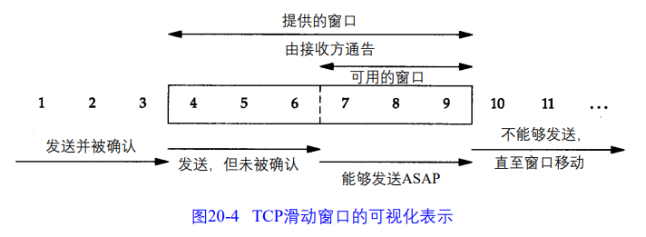

# 第 20 章 TCP 的成块数据流

## 20.1 引言

本章介绍

TCP 滑动窗口协议，一种流量控制方法。

TCP 的 PUSH 标志。

慢启动 TCP 使用该技术在一个连接上建立数据流。

成块数据流的吞吐量。

## 20.2 正常数据流

讲了三个例子。

主机 svr4 单向传输 8192 个字节到主机 bsdi

同样两个主机之间交换同样数据

从一个快的发送方到一个慢的接收方

## 20.3 滑动窗口

接收方通告的窗口称为『提出窗口』

三个术语来描述窗口左右边沿的运动

+ 窗口合拢：窗口左边沿向右边沿靠近，发生在数据被发送和确认时。
+ 窗口张开：窗口右边沿向右移动，发生在另一端的接收进程读取已经确认的数据并释放了 TCP 的接收缓存
+ 窗口收缩：右边沿向左移动，RFC 强烈建议不要这么做，但是某一端这么做时 TCP 能够进行处理。3

零窗口：左边沿到达右边沿，发送方不能发送数据。

下面介绍一个例子。

例子总结如下：

+ 发送方不必发送一个全窗口大小的数据
+ 来自接收方的一个报文段确认数据把窗口向右边滑动。这是因为窗口的大小是相对于确认序号的。（感觉就是左端点是收到最大确认序号，右端点是收到最大的（确认序号加窗口号之和））
+ 窗口的大小可以减小，但是窗口的右边沿却不能够向左移动。
+ 接收方在发送一个 ACK 前不必等待窗口被填满。

这个例子还解决了我一个困惑，窗口两次通告不同，怎么防止数据溢出缓冲区。

## 20.4 窗口大小

由接收方提供的窗口的大小通常可以由接收进程控制，这将影响 TCP 的性能。

在 20.7 节介绍：给定通信媒体带宽和两端往返时间，如何计算最小的缓存大小。

举了个例子

## 20.5 PUSH标志

关于 PUSH 标志我的大概理解如下

允许 TCP 提供 应用程序 设置 PUSH 标志的方法。

用处是，应用程序设置 PUSH 标志后，TCP 立即向服务端发送数据而不会因为等待额外数据在缓冲区中滞留。服务端收到 TCP 标志了 PUSH，立即将数据提交给服务器进程而不会等待判断是否还有额外数据。

大概就是关闭了经受时延吧。

目前大多数的 API 没有向应用程序提供通知其 TCP 设置 PUSH 标志的方法，一个好的 TCP 实现应该自行决定何时设置这个标志。

## 20.6 慢启动

慢启动算法：该算法通过观察到新分组进入网络的速率应该与另一端返回确认的速率相同而进行工作。

慢启动为发送方的 TCP 增加了另一个窗口：拥塞窗口（cwdn）

当与另一个网络的主机建立 TCP连接时，拥塞窗口被初始化为 1 个报文段（即另一端通告的报文段大小）。

每收到一个 ACK，拥塞窗口就增加一个报文段（cwnd 以字节为单位，但是慢启动以报文段大小为单位进行增加）。

发送方取拥塞窗口与通告窗口中的最小值作为发送上限。拥塞窗口是发送方使用的流量控制，而通告窗口则是接收方使用的流量控制。

在某些点上可能达到了互联网的容量，于是中间路由器开始丢弃分组。这就通知发送方 它的拥塞窗口开得过大。下一章讨论超时和重传。

## 20.7 成块数据的吞吐量

往返时延（RTT）：取决于传播时延、发送时延（媒体每秒可传输的比特数）。

对于一个给定两点之间的通路，传播时延一般是固定的，而发送时延则取决于分组的大小。

举了一个例子。

### 20.7.1 带宽时延乘积

接收方的通告窗口必须不小于『时延带宽积』（文章的这个应该指的是时延带宽积，还有8太可能是必须吧）

计算通道的容量为：时延带宽积（bit）= 带宽（b/s）* 往返时延（s）

### 20.7.2 拥塞

拥塞：输入流总和大于输出流总和说明发生拥塞，大概这意思。

产生瓶颈的路由器没有足够的缓存空间会引起丢弃分组。

## 20.8 紧急方式

通过设置 TCP 首部中的两个字段发出这种通知：从一端到另一端的紧急数据已经被放置在数据流中。（这句话原话搁这考验我语文水平呢，应该没理解错，原话如下）

> 可以通过设置 TCP 首部中的两个字段来发出这种从一端到另一端的紧急数据已经被放置在数据流中的通知。

紧急数据发送方式：URG 置 1，并且一个 16 bit 的紧急指针指向紧急数据的最后一个字节。（大多数 TCP 实现成了，指向最后一个字节的下一字节）

没有办法指明紧急数据从数据流何处开始。唯一的信息是紧急方式已开始和指向紧急数据最后一个字节的指针。其他事情留给应用程序处理。

带外数据：理解成额外的快速（优先读取）信息通道（我的理解）

许多实现将 TCP 紧急方式称带外数据。（uysy 确实好像能这么整）

下面讲了一个例子。

大概说明

+ 那台操作系统，紧急指针指向了紧急数据的下一字节。
+ 紧急数据会与缓存中的数据一起发送

## 20.9 小结

滑动窗口

提出窗口、拥塞窗口

慢启动

窗口大小：带宽时延乘积

拥塞

PUSH、URG