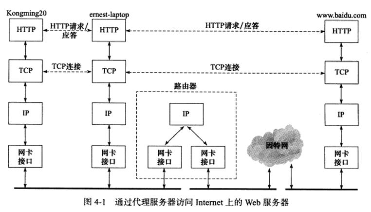

# 第 4 章 通信案例访问Web服务器

## 4.1 实例总图

Kongming20 上进行 HTTP 请求获取，ernest-laptop 运行代理服务器程序。

## 4.2 部署代理服务器

### 4.2.1 HTTP 代理服务器的工作原理

代理服务器按照其使用方式和作用分为：正向代理服务器、反向代理服务器、透明代理服务器。

正向代理：

> 客户端自己设置代理服务器的地址，客户端每次请求都直接发送到该代理服务器，并由代理服务器请求目标资源。
>
> 例如：要访问一些被屏蔽掉的国外网站

反向代理：

> 反向代理设置在服务器端。反向代理指用代理服务器来接收 Internet 上的连接请求，然后将请求转发给内部网络上的服务器，并将从内部服务器上得到的结果返回给客户端。

透明代理：

> 透明代理只能设置在网关上，用户访问 Internet 的数据报必然都经过网关，如果在网关上设置代理，则该代理对用户来说是透明的。透明代理可以看作正向代理的特殊情况

代理服务器通常还提供缓存目标资源功能（可选），这样用户下次访问同一资源时速度将很快。

### 4.2.2 部署 squid 代理服务器

略

## 4.3 使用 tcpdump 抓取传输数据包

详细抓取过程略，大致信息如下：

+ 代理服务器访问 DNS 服务器以查询域名 `www.baidu.com` 对应的 IP 地址
+ 代理服务器通过 ARP 查询路由器 MAC 地址
+ 客户端和代理服务器之间的 HTTP 通信
+ 代理服务器和 Web 服务器之间的 HTTP 通信

## 4.4 访问 DNS 服务器

读取 `/etc/resolv.conf` 文件获得 DNS 服务器的 IP 地址。

然后通过 UDP 访问 DNS 服务器。

然后 IP 层根据路由表进行转发。

如果目标 IP 物理地址未知则通过 ARP 协议获得其物理地址。

通过以上过程成功访问 DNS 服务器，DNS 服务的过程见 1.6 节。

## 4.5 本地名称查询

通过域名访问主机时，需要 DNS 服务来获取主机的 IP 地址。但如果通过主机名访问本地局域网的机器，则可通过本地的静态文件来获取该机器 IP 地址。

Linux 将目标主机名及其 IP 地址存储在 `/etc/hosts` 配置文件中，如 localhost（127.0.0.1）。

+ 查询某个主机名对应 IP 时，首先查询该文件。
+ 如果未在其中找到目标主机名对应 IP 地址，将求助 DNS 服务。

## 4.6 HTTP 通信

略

## 4.7 实例总结

总体流程见 4.3

略

