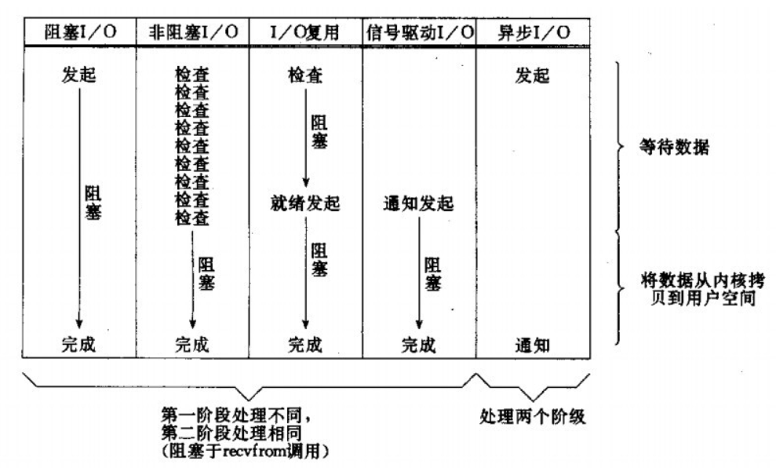
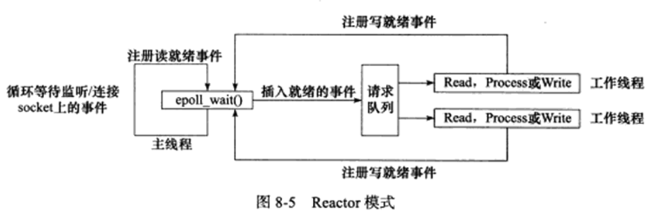
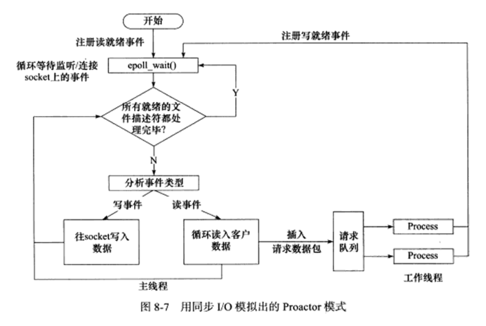
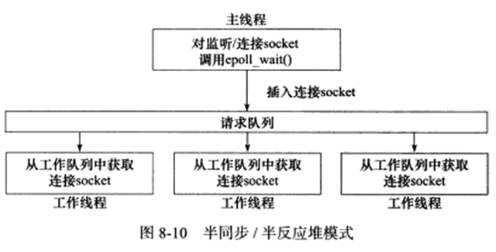
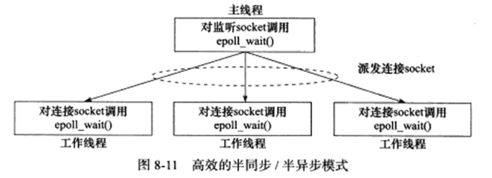

# 第 8 章 高性能服务器程序框架

服务器解构为如下三个主要模块：

+ I/O 处理单元：介绍四种 I/O 模型和两种高效事件处理模式。
+ 逻辑单元：介绍两种高效并发模式，以及有限状态机。
+ 存储单元：不做介绍

## 8.1 服务器模型

### 8.1.1 C/S 模型

略

### 8.1.2 P2P 模型

略

## 8.2 服务器编程框架

| 模块         | 单个服务器程序             | 服务器机群                   |
| ------------ | -------------------------- | ---------------------------- |
| I/O 处理单元 | 处理客户连接、读写网络数据 | 作为接入服务器，实现负载均衡 |
| 逻辑单元     | 业务进程或线程             | 逻辑服务器                   |
| 网络存储单元 | 本地数据库、文件或缓存     | 数据库服务器                 |
| 请求队列     | 各单元之间的通信方式       | 各服务器之间的永久 TCP 连接  |

## 8.3 I/O 模型

同步 I/O 有四种：阻塞 I/O、非阻塞 I/O、I/O 复用、信号驱动 I/O。

异步 I/O：I/O 读写由内核接管，数据处理完成后会通过信号通知。

## 8.4 两种高效的事件处理模式

同步 I/O 模型通常实现 Reactor 模式。

异步 I/O 模型通常实现 Proactor 模式。

### 8.4.1 Reactor 模式

主线程（I/O 处理单元，下同）只负责监听文件描述符上是否有事件发生，有的话立即将该事件通知工作线程（逻辑单元，下同）。除此之外，主线程不做任何其他实质性工作。

使用同步 I/O 模型（以 epoll_wait 为例）实现的 Reactor 模式的工作例程是：

+ 主线程往 epoll 内核事件表中注册 socket 上的读就绪事件
+ 主线程调用 epoll_wait 等待 socket 上有数据可读
+ 当 socket 上有数据可读时，epoll_wait 通知主线程。主线程则将 socket 可读事件放入请求队列
+ 睡眠在请求队列上的某个工作线程被唤醒，它从 socket 读取数据，并处理客户请求，然后往 epoll 内核事件表中注册该 socket 上的写就绪事件
+ 主线程调用 epoll_wait 等待 socket 可写。
+ 当 socket 可写时，epoll_wait 通知主线程。主线程将 socket 可写事件放入请求队列。
+ 睡眠在请求队列上的某个工作线程被唤醒，它往 socket 上写入服务器处理客户端请求的结果。

### 8.4.2 Proactor 模式

与 Reactor 模式不同，Proactor 模式将所有 I/O 操作都交给主线程和内核来处理，工作线程仅仅负责业务逻辑。

使用同步 I/O 模型（epoll_wait 为例）模拟 Proactor 模式工作流程如下：

+ 主线程往 epoll 内核事件表中注册 socket 读就绪事件。
+ 主线程调用 epoll_wait 等待 socket 上有数据可读。
+ 当 socket 上有数据可读时，epoll_wait 通知主线程，主线程从 socket 循环读取数据，直到没有数据可读，然后将数据封装成一个请求对象并插入请求队列。
+ 睡眠在请求队列上的某个工作线程被唤醒，它获取请求对象并处理客户端请求，然后往 epoll 内核事件表中注册 socket 上写就绪事件。
+ 主线程调用 epoll_wait 等待 socket 可写
+ 当 socket 可写时，epoll_wait 通知主线程。主线程往 socket 上写入服务器处理客户请求的结果。

## 8.5 两种高效的并发模式

并发编程的目的是让程序『同时』执行多个任务。如果程序是计算密集型，并发编程没有优势，反而由于任务的切换使效率降低。如果是 I/O 密集型，如经常读写文件，访问数据库，则 CPU 利用率会提升。

主要有两种并发编程模式：半同步/半异步模式、领导者/追随者模式。

### 8.5.1 半同步/半异步模式

与 I/O 模型不同，并发模型中同步与异步概念如下。

同步：程序完全按照代码顺序执行。效率低、逻辑简单。

异步：指程序的执行需要由系统事件来驱动，如中断、信号。快，程序复杂，难扩展。

半同步/半异步：同步线程用于处理客户逻辑，异步线程用于处理 I/O 事件。

#### 半同步/半反应堆模型

半同步/半反应堆模型：主线程即唯一异步线程负责监听事件，任务到来时请求队列上的工作线程通过竞争获得任务的接管权。

该图（8-10）说明半同步/半反应堆模式采用事件处理模式是 Reactor 模式，要求工作线程自己从 socket 上读取客户请求和往 socket 写入服务器应答。

当然也可以用 Proactor 事件处理模式，即由主线程来完成数据读写，这种情况下主线程会将信息封装为一个任务对象，然后将其插入请求队列。

第 15 章给出一个用半同步/半反应堆模式实现的简单 Web 服务器的代码。

半同步/半反应堆模式缺点：

+ 主线程往请求队列添加任务，或者工作线程从请求队列取出任务，需要队请求队列加锁保护，浪费时间。
+ 每个工作线程同一时间只能处理一个客户请求。如果客户数量较多，工作线程较少，堆积任务对象，客户端响应时间变慢。如果增加工作线程解决，则工作线程的切换也耗费 CPU 时间。

#### 高效的半同步/半异步模式

下图介绍一种相对高效的半同步/半异步模式

每个线程维持自己的事件循环，每个线程都工作在异步模式，非严格意义上的半同步/半异步模式。第 15 章给出一个这种方法实现的 CGI 服务器代码。

### 8.5.2 领导者/追随者模式

领导者/追随者模式是多个工作线程轮流获得事件源集合，轮流监听、分发并处理事件的一种模式。

大概意思就是，每次一个领导者监听事件，发生事件后从线程池中取出新的领导者监听事件，而原型的领导者去处理事件。

需要如下几个组件：

+ 句柄集：句柄表示 I/O 资源，句柄集管理句柄，可以监听句柄上的 I/O 事件。
+ 线程集：大概就是一个线程池
+ 事件处理器：绑定到某个句柄，处理事件

领导者/追随者模式优点及缺点

+ 不需要在线程之间传递额外数据
+ 无须同步对队列的访问
+ 缺点仅支持一个事件源集合，无法像图 8-11 所示那样，每个工作线程管理多个连接

## 8.6 有限状态机

逻辑单元内部的一种高效编程方法：有限状态机。

一个例子，大概就是将 HTTP 请求的字符串在状态机跑一遍，得到应该处理的方法。

详细实例代码略，到时实现 Web 服务器时在仔细阅读。

## 8.7 提高服务器性能的其他建议

服务器性能的影响因素由：CPU的个数、速度、内存大小、允许用户打开的最大文件描述符数量、程序本身（本节讨论）。

前面介绍了几种事件处理模式和并发模型，以及有限状态机。下面介绍池、数据复制、上下文切换、锁。

### 8.7.1 池

池：预先静态分配的资源，需要相关资源时直接从池中获取，避免对内核的访问。可以预先分配一定的资源，不够在动态分配一些加入池。

常见池有：

+ 内存池：通常用于 socket 的接收缓存和发送缓存
+ 进程池、线程池：并发编程常用技巧，处理新的请求时直接从池中获取执行实体。
+ 连接池：常用于服务器内部永久连接，如访问数据库。

### 8.7.2 数据复制

应该避免不必要的数据复制，尤其是复制发生在内核和用户代码之间时。如传输文件（验证文件是否存在、有无权限后直接发送，无需读入程序缓冲区发送，用 sendfile）、进程间传递数据（共享内存）。

### 8.7.3 上下文切换和锁

上下文切换问题，即进程或线程切换导致系统开销，即使 I/O 密集型也不应该使用过多的工作线程（或工作进程，下同）。图 8-11 模式是一个比较好的解决方案。

共享资源的加锁保护问题。锁会导致降低效率，应该减小锁的粒度，如读写锁。

