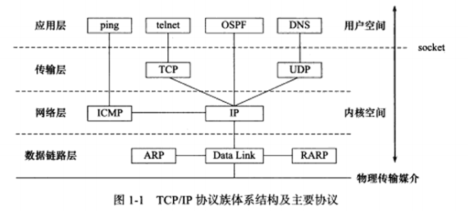

# 第 1 章 TCP/IP 协议族

## 1.1 TCP/IP 协议族体系结构以及主要协议

四层协议，自底向上：数据链路层层、网络层、传输层、应用层。




### 1.1.1 数据链路层

数据链路层实现了网卡接口的网络驱动程序，以处理数据在物理媒介上的传输。

常用协议有：ARP（地址解析协议）、RARP（逆地址解析协议）

这两个协议实现 IP 地址和机器物理地址（通常是 MAC 地址）之间的相互转换。

ARP 协议的用途：

> 网络层使用 IP 地址寻址一台机器，数据链路层使用物理地址寻址一台机器，因此网络层必须先将目标机器的 IP 地址转化成物理地址，才能使用数据链路层提供的服务。


RARP：

> 网络上某些无盘工作站，因缺乏存储设备，无法记住自己的 IP 地址，利用网卡上的物理地址向网络管理者（服务器或网络管理软件）查询自身的 IP 地址。运行 RARP 服务的网络管理者通常存有该网络上所有机器的物理地址到 IP 地址的映射。（不知道怎么突然就想到网吧的主机）


### 1.1.2 网络层

网络层实现数据包的选路和转发。

通信的主机一般不是直接相连的，而是通过多个中间节点（路由器）连接的。网络层的任务就是选择这些中间节点以确认通信路径。

网络层对上层协议隐藏连接细节，使得在传输层和网络应用程序看来，通信双方是直接相连的。

网络层的协议：IP 协议、ICMP 协议（internet 控制报文协议）。

IP 协议根据数据包的目的 IP 地址决定如何投递它，第 2 章详细讨论。

ICMP 协议主要用于检测网络连接，ICMP 报文分两类：

+ 差错报文：回应网络错误，如目标不可到达、重定向
+ 查询报文：查询网络信息，如 ping 查询目标是否可到达


### 1.1.3 传输层

传输层实现两台主机上端到端的通信。传输层只关心通信的起始端和目的端。

传输层协议主要有三个：TCP 协议、UDP 协议、SCTP 协议。

TCP 协议：提供可靠的、面向连接的、基于流的服务。

> 使用超时重传、数据确认等方式确保数据包被正确发送至目的端。使用 TCP 协议通信，双方必须先建立 TCP 连接，并在内核中为该连接维持一些必要数据结构，如：连接状态、读写缓冲区、定时器等。


UDP 协议：不可靠、无连接、基于数据报的服务。

> 不可靠：无法保证数据正确地传送到目的端
>
> 无连接：通信双方不需要建立连接
>
> 基于数据报：相对基于流而言，每个数据报必须一次读出。


SCTP 协议：较新的传输层协议，本书不讨论。


### 1.1.4 应用层

应用层负责处理应用程序的逻辑。

前三层必须稳定高效，因此在内核空间中实现，而应用层在用户空间实现（少数服务器程序在内核中实现，本书只讨论用户空间的网络编程）。

举例几个应用层协议：

+ ping（是应用程序，不是协议）
+ telnet 协议（一种远程登录协议）
+ OSPF 协议（开放最短路径优先），用于动态路由更新的协议，用于路由器之间的通信，告诉对方各自路由信息。
+ DNS 协议（域名服务）提供机器域名到 IP 地址的转换。（后面介绍）


应用层协议可能跳过传输层直接使用网络层提供的服务，比如 ping 程序和 OSPF 协议。

可以通过 `/etc/services` 文件查看所有知名的应用层协议，以及它们都能使用哪些传输层服务。


## 1.2 封装

封装：应用程序在发送到物理网络上之前，沿着协议栈从上至下依次传递，每层在上层数据的基础上加上自己的头部信息（有时包括尾部）以实现该层的功能。

+ 经 TCP 封装后的数据称为『TCP 报文段』，发送端应用程序向 TCP 连接写入数据时，内核中 TCP 模块首先把数据复制到与该连接对应的 TCP 内核发送缓冲区中。然后 TCP 模块调用 IP 模块提供的服务。
+ 经 UDP 封装后的数据称为『UDP 数据报』，UDP 对应用程序的封装与 TCP 类似，不同的是 UDP 无需为应用层数据保存副本（因为是不可靠连接）。
+ 经 IP 封装后的数据称为『IP 数据报』
+ 经数据链路层封装的数据称为『帧』，根据传输媒介不同，帧的类型不同，如以太网帧、令牌环帧。


MTU（帧最大传输单元），帧最多能携带多少上层协议数据（比如 IP 数据报）。过长的 IP 数据报可能需要被分片传输。

帧才是最终在物理网络上传送的字节序列。


## 1.3 分用

分用：帧到达目的主机时，沿着协议栈自底向上依次传递。各层协议依次处理帧中本层负责的头部数据，最后将帧交给目标应用程序。


## 1.4 测试网络

略


## 1.5 ARP 协议工作原理

ARP 协议能实现任意网络层地址到任意物理地址的转换，本书仅讨论从 IP 地址到以太网地址（MAC 地址）的转换。

工作原理：

> 主机向自己所在的网络广播一个 ARP 请求，该请求包含目标机器的网络地址。此网络上的其他机器都将收到这个请求，但只有被请求的目标机器会回应一个 ARP 应答，其中包含自己的物理地址。


### 1.5.1 以太网 ARP 请求/应答报文详解

这里介绍报文的格式及含义，略。


### 1.5.2 ARP 高速缓存的查看和修改

通常 ARP 维护一个高速缓存，包含经常访问（比如网关地址）或最近访问的机器的 IP 地址到物理地址的映射。避免重复的 ARP 请求。

Linux 下使用 `arp` 命令查看和修改 ARP 高速缓存。

`arp -a` 显式全部 APR 缓存

`arp -d ip地址` 删除对应的 ARP 缓存

`arp -s ip地址 物理地址` 添加 APR 缓存


### 1.5.3 使用 tcpdump 观察 ARP 通信过程

主机 A（192.168.1.102）

`sudo tcpdump arp -c 10 -w arp.cap`

`ping 192.168.1.103`

主机 B（192.168.1.103）

查看包

`sudo tcpdump -r arp.cap`

```
wzy@wzypc:~/tmp$ sudo tcpdump -r arp.cap 
reading from file arp.cap, link-type EN10MB (Ethernet)
21:37:15.058164 ARP, Request who-has 192.168.1.100 tell _gateway, length 46
21:37:24.922430 ARP, Request who-has 192.168.1.103 tell wzypc, length 28
21:37:24.922833 ARP, Reply 192.168.1.103 is-at 00:0c:29:36:e1:a2 (oui Unknown), length 46
```

```
wzy@wzypc:~/tmp$ arp -a
_gateway (192.168.1.1) 位于 60:3a:7c:1f:9c:3f [ether] 在 ens33
? (192.168.1.103) 位于 00:0c:29:36:e1:a2 [ether] 在 ens33
```


粗略快速看了下 tcpdump 的用法，这 `arp.cap` 文件三个包大概意思应该是，前两个包是广播请求，第三个是收到目标机器的 ARP 应答，其中包含目标机器的 MAC 地址。


## 1.6 DNS 工作原理

DNS 用来将域名转换成 IP 地址。

DNS 是一套分布式的域名服务系统。每个 DNS 服务器上存放大量的机器名和 IP 地址的映射，并且动态更新。众多网络客户端程序都使用 DNS 协议来向 DNS 服务器查询目标主机的 IP 地址。


### 1.6.1 DNS 查询和应答报文详解

介绍 DNS 查询和应答报文的格式及含义，略。


### 1.6.2 Linux 下访问 DNS 服务

要访问 DNS 服务，必须先知道 DNS 服务器的 IP 地址。Linux 使用 `/etc/resolv.conf` 文件存放 DNS 服务器的 IP 地址。

Linux 下一个常用的访问 DNS 服务器的客户端程序是 host。

```
wzy@wzypc:~$ host -t A www.baidu.com
www.baidu.com is an alias for www.a.shifen.com.
www.a.shifen.com has address 36.152.44.96
www.a.shifen.com has address 36.152.44.95
```

host 详细用法参考 man 手册。


### 1.6.3 使用 tcpdump 观察 DNS 通信过程

`sudo tcpdump -i any -nt -s 500 port domain` port domain 表示只抓取使用域名服务的数据包。

`host -t A www.baidu.com`

输出结果如下：

```
wzy@wzypc:~$ sudo tcpdump -i any -nt -s 500 port domain
tcpdump: verbose output suppressed, use -v or -vv for full protocol decode
listening on any, link-type LINUX_SLL (Linux cooked), capture size 500 bytes
IP 127.0.0.1.44384 > 127.0.0.53.53: 26247+ A? www.baidu.com. (31)
IP 192.168.1.102.39848 > 211.140.188.188.53: 53797+ A? www.baidu.com. (31)
IP 211.140.188.188.53 > 192.168.1.102.39848: 53797 3/0/0 CNAME www.a.shifen.com., A 36.152.44.96, A 36.152.44.95 (90)
IP 127.0.0.53.53 > 127.0.0.1.44384: 26247 3/0/0 CNAME www.a.shifen.com., A 36.152.44.95, A 36.152.44.96 (90)
```


这书好像没提到（我没看到）DNS 解析过程，有好几种（递归解析、迭代解析），下面介绍它们的混合版本：

+ 查询本机 DNS 缓存是否存在目标域名的 IP 地址，没有进入下一步。
+ 向本地配置的 DNS 域名服务器发起域名解析请求，运营商先查找自身的缓存是否存在，有则返回，无则由运营商发起迭代请求。
+ 运营商先查询根域的 DNS 地址、再查询一级域、二级域，直到查找到返回给本地主机。


## 1.7 socket 和 TCP/IP 协议族的关系

应用程序需要能够访问 TCP/IP 协议族提供的服务，实现这组调用的 API 有：socket 和 XTI（基本不用，本书讨论 socket）。

socket 定义的这组 API 提供如下两点功能：

+ 将应用程序数据复制到 TCP/UPD 内核发送缓冲区，以交付内核来发送数据；从 TCP/UDP 接收缓冲区复制数据到用户缓冲区，以读取数据
+ 应用程序通过它们修改内核中各层协议的某些头部信息或其他数据结构，以控制底层通信行为。

