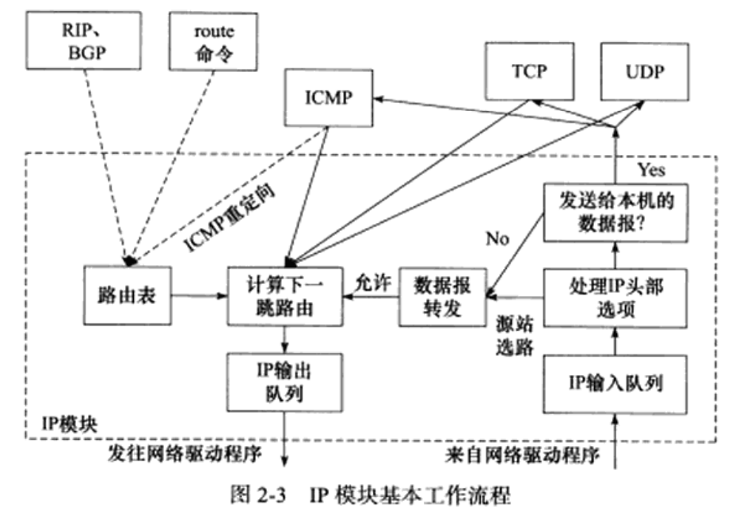

# 第 2 章 IP 协议详解

## 2.1 IP 服务的特点

IP 协议为上层协议提供无状态、无连接、不可靠的服务。

无状态：IP 数据报之间没有上下文关系，可能是乱序的、重复的（用一个唯一标识处理重复和分片）。

无连接：IP 通信双方都不长久地维持对方的任何信息。

不可靠：不能保证 IP 数据报准确地到达接收端。


## 2.2 IPv4 头部结构

### 2.2.1 IPv4 头部结构

细节略，大致有如下几点：

+ 版本号，区分协议
+ 头部长度，IP 头部有多少 32 bit
+ 总长度：IP 数据报的长度
+ 标识符：区分每个数据报
+ 标志字段：提供分片功能的支持
+ 分片偏移：数据的偏移量，分片、重组需要使用。
+ 生存时间（TTL）：到达目的地之前允许经过路由器的跳数，常见为 64，每经过一个路由值减一，值为 0 时路由器丢弃数据报，返回 ICMP 差错报文。可以用来防止数据报陷入路由循环。
+ 8 位协议：区分上层协议。
+ 头部校验和：仅检验头部数据是否损坏
+ 源端 IP 和目的端 IP


### 2.2.2 使用 tcpdump 观察 IPv4 头部结构

`sudo tcpdump -ntx -i lo` 然后随便使用下网络上的服务，会看到数据报。


## 2.3 IP 分片

当 IP 数据报超过帧的 MTU 时，将被分片传输。分片可能发生在发送端，也可能发生在中转路由器上。

IP 分片和重组由如下三个字段提供足够信息：数据报标识、标志、片偏移。一个 IP 数据报的每个分片有自己的 IP 头部，具有相同的标识值，但有不同的片偏移。

以太网帧的 MTU 是 1500 字节（可通过 `ifconfig` 查看），IP 头部通常是 20 字节。

具体分片略。


## 2.4 IP 路由

IP 协议的一个核心任务是数据报的路由，即决定发送数据报到目标机器的路径。


### 2.4.1 IP 模块工作流程



虚线表示路由表更新的过程。

详细介绍，略。


### 2.4.2 路由机制

`route` 或 `netstat` 命令可以查看路由表。

```bash
wzy@wzypc:~$ route
内核 IP 路由表
目标            网关            子网掩码        标志  跃点   引用  使用 接口
default         _gateway        0.0.0.0         UG    100    0        0 ens33
link-local      0.0.0.0         255.255.0.0     U     1000   0        0 ens33
192.168.1.0     0.0.0.0         255.255.255.0   U     100    0        0 ens33
```

default（默认路由项） G 标志说明下一跳目标是网关


### 2.4.3 路由表更新

动态更新路由表略，2.6 节介绍 ICMP 重定向更新路由表。


## 2.5 IP 转发

处理 TTL、分片、转发报文。


## 2.6 重定向

ICMP 重定向报文也能用于更新路由表。

格式略。

大致意思如下：

+ A 发送 IP 数据报给 B
+ B 将其转发至 C
+ B 发送 ICMP 重定向报文给 A，A 更新路由表
+ 之后 A 发送的报文将直接发送给 C


## 2.7 IPv6 头部结构

解决 IPv4 地址不足的问题，还做了很大改进。

略

